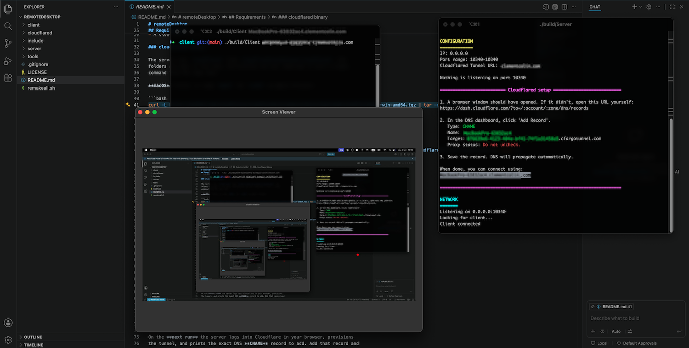

# remoteDesktop

An experimental app that streams a machine's screen to a remote viewer over a
self-provisioned **Cloudflare tunnel**. It is **view-only**. It shows the screen
and cursor, but remote input (mouse and keyboard control) is not implemented.
Built as a personal project to explore screen capture, MJPEG streaming, and
tunnel automation in C++.

It runs on **macOS and Linux**, and the two interoperate: a Linux client can view
a macOS server and vice versa.



> ⚠️ **Experimental, personal use only.** The stream is *unauthenticated*. See
> [Limitations & security](#limitations--security) before running it.

## How it works

**Server** (the machine being viewed):
- `Screenshot` captures the screen.
- `Network` streams over a raw socket using a **custom differential protocol**. It sends an initial full JPEG frame, then only the changed regions ("dirty tiles") as small JPEGs tagged with their coordinates, so unchanged areas are not re-sent.
- `CloudflaredTunnel` creates and manages a Cloudflare tunnel that exposes the local stream at a public hostname, and parses the credentials it generates.
- `ConfigFileParser` is a hand-written tokenizer and directive parser for an nginx-style `server.conf`.

**Client** (the viewer): a Qt app (`MjpegClient`) that reads the stream and
reconstructs the screen, applying full frames and painting the changed tiles onto
the running image. A dedicated client is required. The wire format is custom (not
standard MJPEG), so a browser cannot render it.

## Requirements

- Qt 6 (Core, Gui, Widgets, Network, Concurrent). The server also needs OpenSSL.
- CMake 3.16 or newer, and a C++20 compiler.
- `cloudflared`, the binary (see below). It is not bundled in the repo.
- A Cloudflare account and a domain you control.

### cloudflared binary

The server runs `cloudflared` from `cloudflared/<platform>/cloudflared`. The
folders are kept in the repo, the binaries are not. Download it with a single
command from the repo root.

**macOS** (Intel, or swap `amd64` for `arm64` on Apple Silicon):

```bash
curl -L https://github.com/cloudflare/cloudflared/releases/latest/download/cloudflared-darwin-amd64.tgz | tar -xz -C cloudflared/mac && chmod +x cloudflared/mac/cloudflared
```

**Linux** (x86-64, or swap `amd64` for `arm64` on ARM):

```bash
curl -L https://github.com/cloudflare/cloudflared/releases/latest/download/cloudflared-linux-amd64 -o cloudflared/linux/cloudflared && chmod +x cloudflared/linux/cloudflared
```

## Build

```bash
./remakeall.sh            # builds both client and server
```

Or build a component directly with cmake:

```bash
cmake -S server -B server/build -DCMAKE_PREFIX_PATH=/usr/local/opt/qt
cmake --build server/build
```

`CMAKE_PREFIX_PATH` points at Homebrew Qt on macOS, so adjust it if your Qt lives
elsewhere.

## Cloudflare account

You need a Cloudflare account and a domain you control. You do **not** run any
`cloudflared` commands yourself.

The **first run** creates the config file and stops, asking you to set your
domain. Open `~/.local/share/remoteDesktop/server.conf`, set `cloudflaredUrl` to
your Cloudflare-managed domain, and run again.

On the **next run** the server logs into Cloudflare in your browser, provisions
the tunnel, and prints the exact DNS **CNAME** record to add. Add that record and
the client can connect.

## Configure

The server reads `~/.local/share/remoteDesktop/server.conf` (created on first run):

```
listenIP 0.0.0.0;
listenPortRange 10000 11000;
cloudflaredUrl example.com;    # your domain
```

Edit it with `./server/editConf.sh`. It is parsed by a hand-written nginx-style
parser (directives end with `;`, `#` starts a comment) that reports errors with
`file:line:col`. Supported directives:

| Directive | Args | Meaning |
|---|---|---|
| `listenIP <ip>;` | 1 | Interface to bind (`0.0.0.0` = all interfaces). Validated as an IP. |
| `listenPortRange <start> <end>;` | 2 | Port range the server picks its listen port from. Both validated, `end >= start`. |
| `cloudflaredUrl <domain>;` | 1 | Domain used to build the tunnel hostname. |

## Run

```bash
# On the machine to be viewed. Captures the screen, streams, opens the tunnel:
cd server && make run          # or ./build/Server
```

The server prints the DNS record to add and the public hostname to connect to.

```bash
# On the viewer:
./client/build/Client <hostname>       # e.g. host.example.com
```

## Reset

```bash
./server/cleanCloudflarestuff.sh       # deletes tunnels and wipes ~/.local/share/remoteDesktop
```

## Limitations & security

This is an experimental personal project, not a production tool.

- **View-only.** Remote input (mouse and keyboard control) is not implemented. You
  can see the screen and cursor but not interact with the machine.
- **No authentication.** The server streams to any connection that reaches it. It
  does not even parse the request. Viewing needs the client, because the wire
  format is custom and a browser cannot render it, but that client lives in this
  repo. Anyone with the URL and this code can watch the screen. The only real
  barrier is the obscurity of the hostname.
- **Transport is encrypted** end to end via Cloudflare (TLS at the edge plus an
  encrypted tunnel), so the risk is *unauthorized viewing*, not interception.
- **Do not run it pointed at anything sensitive.** A production version would gate
  the stream behind an auth layer such as Cloudflare Access or an app-level token.

## License

Released under the [MIT License](LICENSE).
